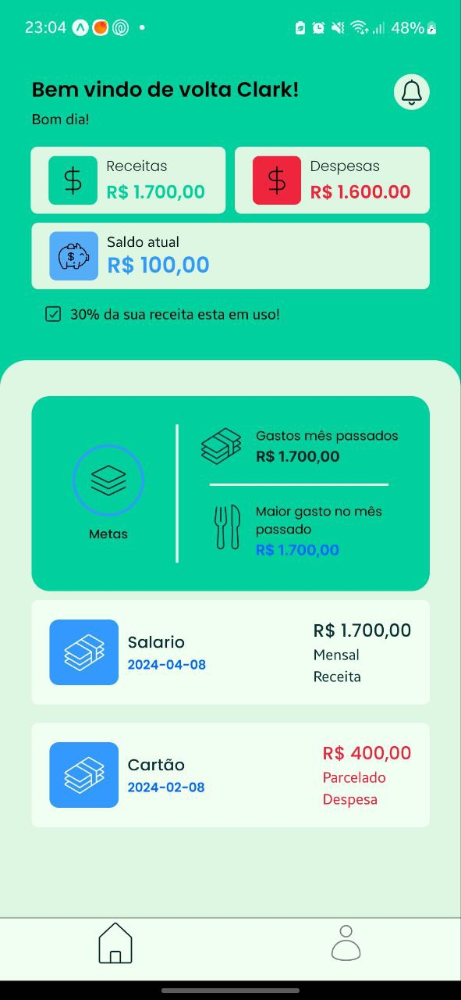

# FinanceApp

## 💰 Sobre o Projeto

FinanceApp é uma aplicação desenvolvida para auxiliar no gerenciamento financeiro pessoal. O objetivo é proporcionar uma experiência simples e eficiente para acompanhar gastos, receitas e planejamento financeiro.

## 📱 Mobile (Em Espera)

### 🚀 Tecnologias Utilizadas

- ⚛️ **React Native**  
- 🛆 **Expo**  
- 🧰 **TypeScript**  
- 🎨 **TailwindCSS**  

### 🛠️ Como Rodar o Projeto Mobile

1. No terminal, acesse a pasta do projeto:
   ```sh
   cd mobile
   ```
2. Instale as dependências:
   ```sh
   yarn
   ```
3. Inicie o projeto:
   ```sh
   yarn start
   ```
4. Caso esteja utilizando WSL e tenha problemas na execução, utilize:
   ```sh
   yarn tunnel
   ```

### 📸 Preview Atual do Projeto



---

## 🖥️ Backend (Em Desenvolvimento)

### 🚀 Tecnologias Utilizadas

- ⚡ **Fastify.JS**  
- 🛆 **Prisma ORM**  
- 🧰 **TypeScript**  
- ⚙️ **Zod**  
- 🐘 **PostgreSQL**  
- 🐋 **Docker Compose**  

### 🛠️ Como Rodar o Projeto Backend

1. No terminal, acesse a pasta do projeto:
   ```sh
   cd backend
   ```
2. Instale as dependências:
   ```sh
   yarn
   ```
3. Inicie o backend:
   ```sh
   yarn start
   ```
4. O backend roda por padrão na porta **8080**.

---

## 📌 Próximos Passos

- Finalizar o back-end
- Dar continuidade a interface do aplicativo
- Implementar autenticação de usuários
- Criar dashboard interativo para melhor visualização de dados financeiros

---

### 👨‍💻 Sobre o Desenvolvedor

Criado e mantido por **Clark**, apaixonado por desenvolvimento mobile e backend. Sempre buscando melhorar a experiência do usuário e otimizar a performance das aplicações.

🔗 [LinkedIn](www.linkedin.com/in/clarkferreira) | 📧 [Email](amorimclark@gmail.com)

---

**Contribuições são bem-vindas!** Sinta-se à vontade para abrir issues e enviar PRs para melhorias no projeto. 🚀